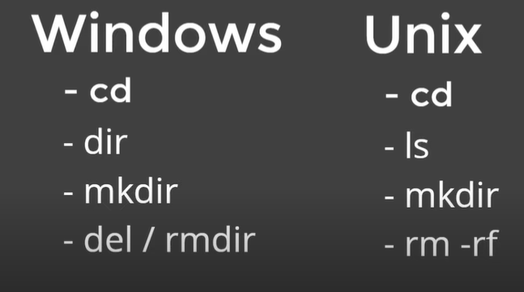
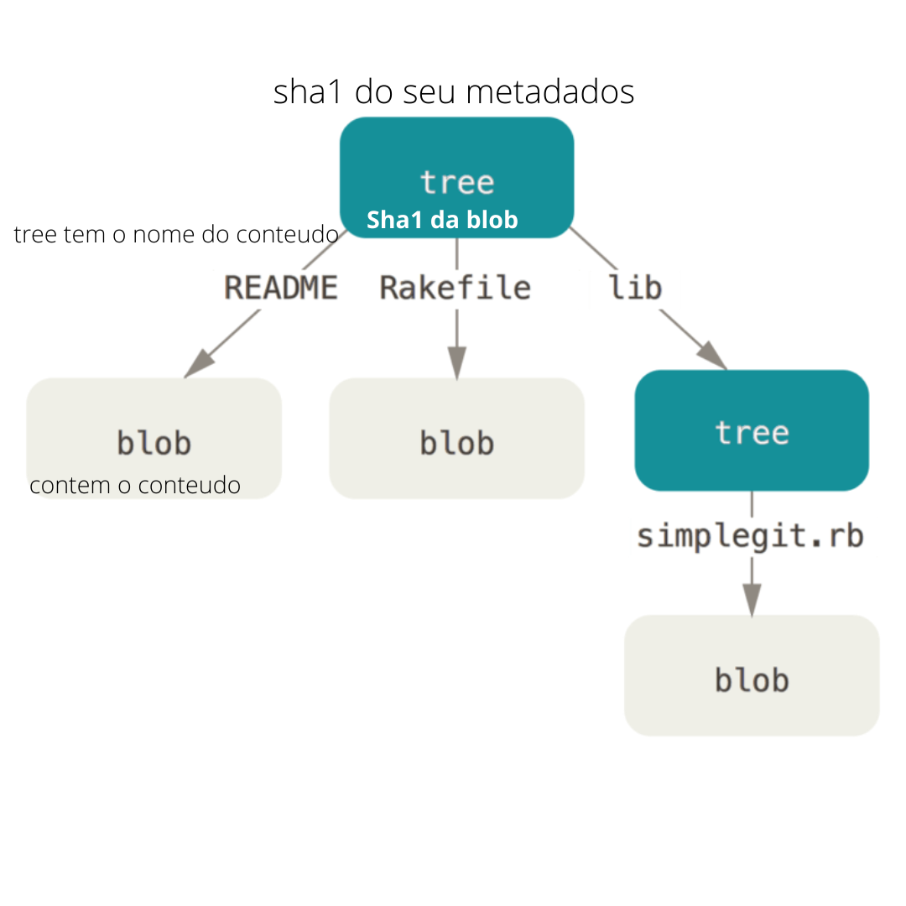
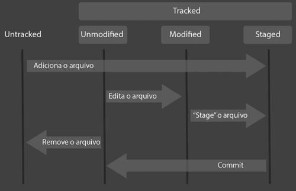
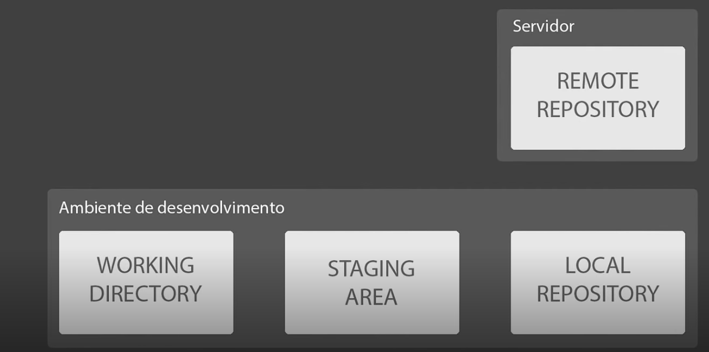

# 
Git & Git Hub

- Controle de Versão:
- Armazenamento em Nuvem:
- Trabalho em Equipe:
- Melhorar o seu Código:
- Reconhecimento:

## O por quê ?

De versão inicial rascunho ao um arquivo bem elaborado, em uma linha cronologia onde podemos resgatar informação ou verificar & existe o Git que faz esse versionamento, do trabalho.

O git é um software que vai nos ajudar a criar e monitorar diferentes versões do nosso código dentro da nossa máquina.

Tendo o git que cuida do gerenciamento do nosso código onde guardamos ele ? No git Hub um repositório online feito pela microsoft.

### Navegação via command line interface:

A maioria dos Sistemas Operacionais possuem programas com um a interface gráfica `GUI (Graphical User Interface)`...
Ou seja a forma que o usuário interage com esses programas é deforma gráfica podendo clicar, arrastar, tudo responde ao comando do usuário seja ele selecionar, clicar e arrastar caixas usar atalhos do teclado.

O software a qual vamos interagir o `GIT` teve seu design voltado para outro tipo de Programa ele é um `CLI(Interface de Linha de Comando(é um programa que permite que os usuários digitem comandos de texto dando instruções a um computador para fazer funções específicas))` hoje em dia tem programa que atrela-se ao git e acrescenta uma interface `GUI` tornando tudo mais simples, mas usaremos o `CLI` para ter uma boa base do Git por baixo dos panos.

**Pra que podemos trabalhar no CLI do git vamos aprender a navegar:**

#### O que vamos aprender:

- Mudar de pastas;
- Listar as pastas;
- Criar as pastas/ Arquivos;
- Deletar pastas/ Arquivos;

Comandos básicos pra que agente navegue no CLI usando o terminal do sistema operacional pra interagir com o git da maneira que possamos ter um conceito mais base possível.

Já que vamos usar o terminal operacional...

Logo de cara teremos umas diferenciações de comandos entre o Sistema operacional que você esteja usando o motivo é, o terminal do Win é derivado do Shell e o Terminal do Linux é derivado do bash. :

| Windows | Linux  |                                                             
Descrição
 |                                                                              pratica                                                                              |                                                              pratica                                                               |
| :------ | :----: | ------------------------------------------------------------------------------------: | :---------------------------------------------------------------------------------------------------------------------------------------------------------------: | :--------------------------------------------------------------------------------------------------------------------------------: |
| -cd     |   cd   |         
Change Directory(navegação entre pastas) Alterar o diretório.
 |                                                                            `cd /pasta`                                                                            |
| -dir    |   ls   |                   
Listagem de diretorios dentro da pasta que estamos.
 |                                                                `pasta01/` `pasta04/` ` pasta055/`                                                                 |
| -mkdir  | mkdir  |                                                    
Cria-se uma pasta.
 |                                                                      `mkdir` `'nomedapasta'`                                                                      |
| -del    |   x    | 
O `del` no Win se estende só para deletar arquivo e não repositório. 
 |
| -rmdir  | rm -rf |                                                  
Exclui um diretório.
 | **No WIn ->** `rmdir 'nomedaPasta' /s /q `(Exclui uma árvore de diretório (o diretório especificado e todos os seus subdiretórios, incluindo todos os arquivos).) | No Linux -> `rm 'nomedaPasta' -rf` (apagar o arquivo). ` -r( apaga arquivos e subdiretórios.)``-f( apaga sem pedir confirmação.) ` |

## Entendendo como o Git funciona por baixo dos panos:

- Sha1
- Objetos Fundamentais que constituem o sistema;
- Sistema Distribuído/ porque e o que é;
- Segurança/ por que de ser tão seguro;

### Sha1(Algoritmo de Hash Seguro):

Algorítimo de interpretação, pega o arquivo e embaralha.

A saída do Sha, gera uma encriptação(o hash) e a encriptação gera conjunto de caracteres identificador 40dígitos que são únicos e se altero o arquivo executo esse algorítimo ele gera outro 40dígitos de caractere e se desfaço o que alterei no arquivo deixando exatamente igual ele retorna os mesmos caractere, por isso o git faz uso desse Hash pra poder identificar os arquivos de forma segura e rápida.

O SHA é uma forma curta de representar um arquivo.

**Sha1 garante:** Que os arquivos sofreram alteração, em um mesmo arquivo não sofreu alteração ou modificações, garantir que na quele m arquivo tem o conteúdo.

O git roda esse algorítimo não só para arquivos, mas para os seus próprios arquivos fazem uso:

**Os 3 tipos básicos responsável pelo versionamento do GIt:**

- Blobs;
- tree;
- Commits;

### Bolha (Blobs):

O jeito que o git lida com Arquivos ficam guardados dentro desso objeto Blob e a blob contem metadados tipo do obj, tamanho do arquivo, uma \0, conteúdo do arquivo.x

### Arvores (tree):
Ás tree armazena e aponta para blobs e tem seus próprios metadados, uma \0, blob, seu próprio sha1, nome do arquivo diferente de um Blob que só guarda o conteúdo.

**A tree é responsável por montar toda estrutura de onde esta os arquivos onde estão localizados**, e ela pode apontar tanto para blobs ou para outras Arvores o por que de ser assim é que um sistema operacional pode ter diretórios que contem outros diretórios então faz sentido que o git use algo que possa se repetir arvore que aponta para outra arvore.

tree tem sha1 desse metadados, bolhas tem sha1 do arquivo,a tree aponta para a blob, e a arvore tem seu sha1 com seus metadados encriptados, então se consequente mente houver uma mudança em um arquivo da blob mudara o sha1 e ja que tree armazena sha da blob e encripta os metadados mudara também.

Todo esse contexto é afim de que fique claro de que tudo esta interligado se houver alteração mudara toda a estrutura da arvore.

O blob é um objeto que encapsula esse comportamento de diretórios usado para apontar para diretórios que contem arquivos e apontar para eles.

### Commit:

O commit é o que vai juntar tudo e dar sentido pra alteração.

Seus metadados:

- tree e sha1 da arvore;
- parent e sha1 do ultimo commit;
- author a pessoa que alterou;
- mensagem " " que da significado a tudo que foi feito;
- timestamp carimbo do tempo data horário em que foi criado;

A parte genial é que o Commit também tem o seu sha1 que é a encriptação de seus metadados!

Exemplo completo:

Por isso que o Git é tão confiável, quando você tem um commit você ta garantindo que ninguém alterou aquele commit.

É uma forma segura de demonstrar que aquele commit representa o que você quis dizer com o código, não tem como alguém alterar maliciosamente sem que isso tenha ficado claro para o histórico de commits uma vez que altera qualquer coisa muda tudo.  

Por que o Git é um sistema distribuído tão seguro ?

se o software e códigos da versão atual estão na nuvem e tem 40 dev com essa versão e caso venha acontecer algo na nuvem não iremos perder o código porque cada dev tem a versão nada corrompe as versões pq é muito seguro e não ira para de existir pq todos terão o repositório local contendo todos os Commits.

### Chaves (SSH e Token):
O git Hub trouce uma solução melhor do que só dependermos de autenticação, trazendo mais segurança.

### Chaves SSH:
 É uma forma de se estabelecer uma conexão segura encriptada entre 2 maquinas, configuramos a nossa maquina local como uma desktop segura para o Git-Hub com 2 chaves Publica ou Privada.

Processo: Settings => SSh and GPs keys :
Fazer o processo no CLI para gerar a chave e o processo é bem parecido para win e Linux o motivo é que quando instalamos o git vem com o git bash, é um terminal Bash.

`$ ssh-keygen -t ed25519 -C "your_email@example.com"`
logo após mostrará o caminho em uma pasta oculta `.ssh` onde as chaves serão armazenadas.
pedira para criar uma senha secreta.
salvara a identificação.
criara o mesmo id privado so que publico.
fingerprint

Não podemos usar o git clone com HTTPS

### Token de acesso Pessoal: 
O token se a semelha com a autenticação padrão porem em vez de digitar senha pessoal eu coloco o token de senha um aquivo salvo em maquina.

É importante saber que o git abre como 3º git manager core e com a chave token faz o processo de autenticação.

Para fazer o Git clone usamos a chave Https.

## Ciclo de vida dos arquivos:

#### Untracked:
É quando o git não tem ciência do arquivo, ainda não foi rastreado, e alterações neste ainda não podem ser registradas.

#### Tracked: 
É o estado onde o arquivo já está sendo monitorado pelo Git.

**Quando ja esta sendo monitorado...**

Dessa forma, possuímos 3 classificações:

#### Unmodified: 
Quando o arquivo ainda não sofreu alterações.

#### Modified: 
Quando o arquivo já foi alterado em relação ao ultimo commit

#### Staged: 
Quando o arquivo já foi endereçado e aguarda ser transferido ao repositório.

## O que os repositórios significam:

O Ambiente de desenvolvimento nosso pasta;
Stage onde mandando os arquivos para o git preparar o commit;
O commit é o que integra o meu diretório ao local
repositório local onde guarda os commits em nosso pc;
Repositório remoto onde armazena de forma online distribuída;

## Introdução ao GitHub:

user.name & user.email para deixar o author do commit e o github ira pedir.

new repository
readme ja esta criado;

ja temos o repositório local
primeiro precisamos add o pra onde vamos enviar esse repositório local ...
git remote add origin https://github.com/...

origin e apenas apelido atrelado ao endereço para não digitar sempre o https
git remote -v verifica os lista de repositórios remotos para envio.

git push origin master, empurra a master;

## Como resolvemos conflitos :

- O que são;
- Como eles ocorrem;
- Como resolvemos;

Conflitos ocasionados são quando 2 pessoas no mesmos arquivo estão trabalhando e essa pessoa sobe para o git hub e logo após você tenta subir o seu só que o github rejeita avisando que o seu esta indiferente do remoto conflito de merge.

para resolver isso precisamos trazer o que o repositório tem e ele vai nos trazer o arquivo modificado para nós resolvermos
