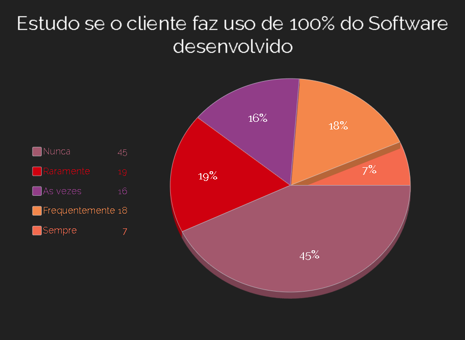
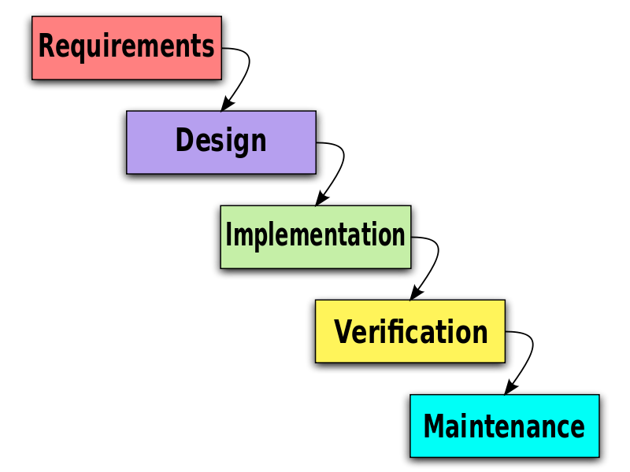
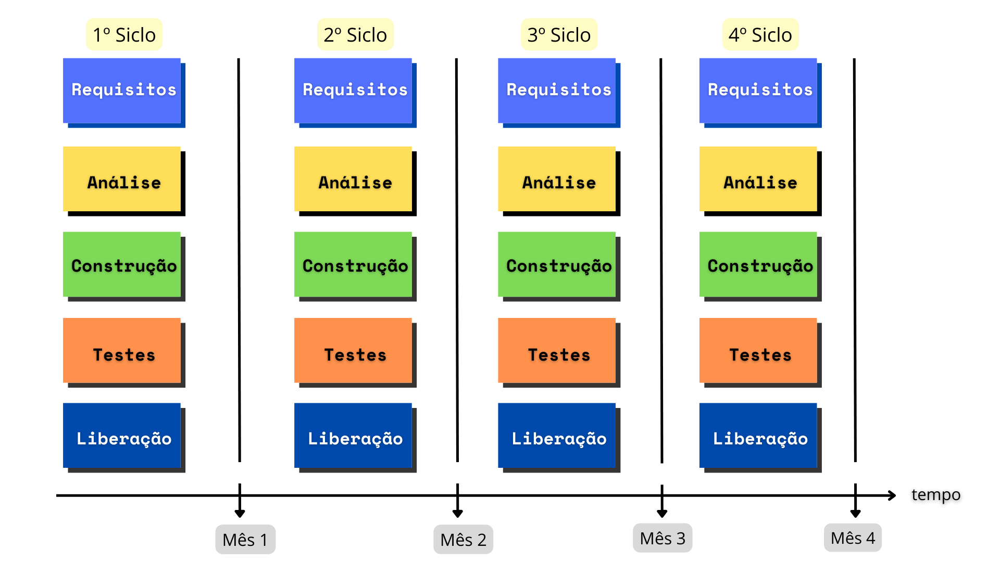
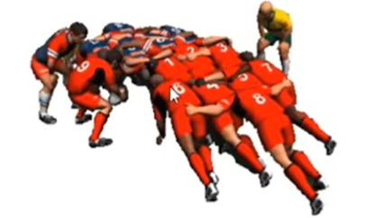
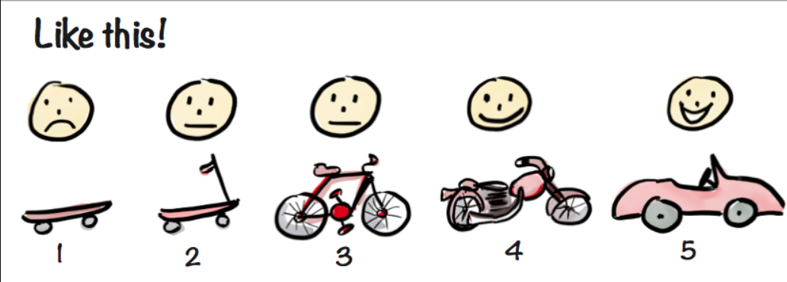

Conceitos Basicos do Scrum;
Papeis e responsabilidades de cada um do time;
Cerimonias do Scrum;

Conceitos Básicos:
Desafios do desenvolvimeno de Software

Como toda empresa de desenvolvimento seja ela pequena ou grande ela tem um objetivo de negocio, desenvolver produto em um determinado tempo alcançado e sastisfazer o cliente.

Com o objetivo definido nasce o Processo de Desnvolvimento para chegar ao produto final:
- Concepção:
- Analise & Design:
- Desenvolvimento:
- Teste:
- Implantação:

O que acontece quando o Cliente faz uso do software adquirido:

Acaba-se que o cliente faz uso de 20% do software, e demaneira clara 80% foi disperdicio da empresa de desenvolvimento em investimento, tempo, colaborador. 

Essa entrega do produto final ao cliente tem muito a ver com a Gestão do Projeto:

#### Tradicional(Waterfall):
Só permite avançar quando 1 fase esta completa.  

- Termina o requeimento após termino passa para o Design e assim sucessivamente de maneira que o projeto siga em modo cascata;

- Quando o acontece a homologação o cliente quer mudar algumas coisas porque não é o que queria; 

 Ou seja não é uma boa gestão usar o Waterfall. 

#### Gestão Ágiu:

O Sooftware é contruido por partes (incremental) e a cada parte é executa-se o siclo (interativo).

|Tradicional|Ágiu|
|-----------|----|
|Escopo definido na fase inicial do projeto(Preditivo: afirmar antecipadamente)| O escopo é definido ao longo do projeto(adaptativo, até porque o cliente não tem algo claro)|
|Projeto é controlado por marcos, tópico atópico|Projeto é controlado por funcionalidades entregues.|
|Cliente só vê o funcionamento na parte final|Cliente pode ver a parte do software funcionando em parte inicial do projeto|
|Resistencia a Mudanças(cliente fica com receio por conta de aumento de custos)|Mudanças constantes de acordo com feedbacks contínuos.|

 Projetos elaborados em Waterfall corre o risco de descobrir que estava errado depois de meses.
Com Scrum, você descobre que estava errado em no máx 30 dias.

O que é ser ágiu ?

- Rapidez(mudança)e desembaraço;
- Fazer coisas Complexas de forma simples.
- Equipe comprometida com os objetivos
- Maior valor para o cliente

Ter a capacidade de responder rapidamente as mudanças.

## Scrum:
_Foi baseado no Rugby através de uma estratégia que é chamada de Scrum, no qual é o reinício de uma jogada no Rugby, onde está todos do times abraçados e comprometido a um objetivo._

- Scrum é um dos Fremeworks de Gestão ágiu;
- Projetos usando equipes pequenas e multidiciplinar produzem os melhores resultados;

## Pilares do Scrum:

1. Transparência;
2. Adaptação;
3. Inspeção;

- Conversar mais e escrever menos.

- Desmosntrar o software constantemente e obter fedbacks continuo.

- Requisitos mudam ao longo do tempo.

- Aprender progressivamente com o software do cliente. 

### Razões para adotar o SCRUM:

1. Desenvolvido e entregue em partes menores (2 a 4 semanas), com constante feedback do Usuário.  

2. Melhor gerenciamento de Riscos;(Redução de incertezas, a cada backlog)
3. Comprometimento, Motivação e Transparência da equipe;(Daily Meeting)

4. Maior valor para o negócio;(Priorização Backlog ao cliente);

5. Usuarios presentes durante o Siclo;

6. Melhoria continua das lições aprendidas ao longo do projeto.

## Caracteristica do time que usa o SCRUM:

* A Equipe é capaz de se auto-organizarem;
* As tarefas são do time e todos os integrantes são responsáveis seja o sucesso e fracasso;
* Forte comprometimento com os Resultados;

#### O motivo bem visual e claro de ser visto é que usar SCRUM permite elaborar o MVP:

De vez o time entregar o produto completo é possivel entregar o minímo produto viavel possivel para que o cliente possa usar e trazer feedbacks.

## Papéis e Responsbilidades do Time SCRUM:

- Product Owner(PO):
    1. Representante da área de Negócios;
    2. PO não é um Comitê;
    3. Define as funcionalidades do software(Product Backlog);
    4. Prioriza as funcionalidades de acordo com o valor do negócio;
    5. Garante que o time de desenvolvimento
    entenda os itens do Backlog no nível necessário.

- Scrum Master(SM):
    1. Garantir o uso correto do SCRUM;
    2. Scrum Master não é Gerente de Projetos;
    3. Age como facilitador; 
    4. Auxilia o Product Owner no planejamento e estimativas do backlog;
    5. Auxilia a equipe a remover impedimentos;
    6. Treina o time em autogerenciamento e interdisciplinaridade;
    
  
- Time de desenvolvimento 3 a 9 pessoas (Dev):
    1.  Possui habilidades suficientes para desenvolver, testar, criar e desenhar, o seja, tudo que for necessário para entregar o software funcionando.

## Cerimonias do Scrum:

### Time-box:

É Tempo máximo para fazer uma cerimonia ou fazer todo desenvolvimento em uma sprint.

Serve para doutrinar o time fazer em um tempo maximo uma cerimonia.

#### Sprint = corrida, arrancada:

A representa um ciclo de trabalho e é um time-boxed de geralmente um mês, onde algum valor é acrescentado a um produto em desenvolvimento. Ou seja, ao final dela, o produto precisa ter algum incremento que gere valor aos olhos do cliente e que satisfaça a meta.

### Composição de uma Sprint:

1. **Sprint Planning:**

2. **Sprint Backlog:**

Corresponde aos agrupamentos dos itens prioritários, isto é, o que será trabalhado na Sprint Scrum, onde uma meta será traçada, visando o desenvolvimento de algum incremento ao produto.

Assim, é criada uma lista de tarefas com base no Product Backlog alinhada com as prioridades já definidas pelo Product Owner, que é o membro do time responsável por direcionar o projeto de acordo com a necessidade do cliente.

3. **Sprint Review:**

4. **Sprint Retrospective:**

5. **Dayli meeting:**

## O Planejamento da Sprint: 

Quem participa: O PO, SM E time Dev.

Duração de 8h do planejamento da sprint, nas primeiras 4h tem um objetivo:

1. O que fazer: O P.O logo apos de passar o product backlog Explica o que ele espera da sprint, o que o time precisa fazer e as funcionabilidades da aquela sprint.

2. Como fazer: Nas outras 4h o time de desenvolvimento quebra as atividades e entende tecnicamente o que precisa ser feito e etima como fazer para entregar os resultados ao PO.

##  Planning Poker: 
Durante esse planejamento de Sprint e o PO ter dito o que espera o time de Dev pode fazer uso de uma tecnica com jogo de cartas com sequencia de Fibonacci.

Objetivo do Planning é acertar o ponto de complexibilidade para o time prever algo sem muita dificuldade no prazo estipulado.

1. **Dayli meeting:**

A Daily Scrum é uma reunião rápida, com duração máxima de 15 minutos, realizada no início de cada dia de desenvolvimento da Sprint. Essa reunião diária visa repassar as atividades do dia anterior e planejar o dia de trabalho que se inicia.

2. **Sprint Review:**

O incremento ao produto geralmente é obtido na Sprint Review, que é uma reunião de revisão que acontece após o final de cada Sprint Scrum com todos os membros do Time Scrum e o cliente, para obter seu feedback quanto à última entrega.

3. **Sprint Retrospective:**

A Sprint Retrospective com o Scrum Team, ela existe para repassar o que foi feito de certo e errado na Sprint Scrum, buscando sempre aprender com as falhas e reconhecer as conquistas.
 
 ## Fundamentos do Projeto ágiu:

 1. Papeis e responsábilidades do Scrum-Master e Product-Owner;

2. Analisando o Escopo e Definindo peioridades;

3. Papel do Product-Owner na Transformação Digital;

Product-Owner:
É um profissional que tem visão do que sera desenvolvido, as necessidades a ser atendidas, o publico que vai fazer uso do software e os objetivos a serem alcançados.

Refining:

É uma reunião que antecede a Plaining com objetivo de apresentar as historias para o Time e o time fazer perguntas diretas ao PO, caso o PO não tenha as respostas das duvidas surgidas ele pode correr atras antes que começe a Sprint Planning o importante é que nessa fase ninguem saia com dúvida.

Reunião da Sprint Planning:

Após a 1º leitura das historias o time analisa o que entra e o que não entra na Sprint.

Na 2º etapa o time ira pegar cada historia e ira escrever quais atividades ira ser desenvolvidas para que a historia seja entregue. Nesta mesma fase o time pode fazer um corte diminuindo a complexibilidade da historia e entregar por parte a historia.

Sprint Backlog:

Após o time ter desenvolvido as atividades, é criado a Sprint-Backlog o PO valida quais são os item prioritario para primeira sprint se essa atividade cair a sprint pode ser cancelada é muito importante essa fase.

Release Planing:

Liberação, lançamento do Softwre, uma nova versão que cada  vez que surge uma modificação ou uma nova versão no final da Sprint, os Dev e o Fabricande deve pensar como distribuir para fazer o melhor merge possivel e evitar conflitos.

Existe 2 tipos de Realease Planing: 

- Mutiplas Squads: Varios times de desenvolvimento fazendo coisas distintas que pode ou não ter relação com outras atividades, mas no final da sprint deve ser agrupado em uma unica release para ser implementada a uma nova versão deixando em produção consequentemente.

- De projeto: O PO tem total visão da demanda e responsabilidade de dividir as historias tendo conciencia de que não é possivel desenvolver uma funcionabilidade complexa em 1 unica Sprint, sendo assim visar entregar o que tem maior valor primeiro ao cliente.

## Analisando escopo e definindo prioridades:

O escopo é algo complexo pelo motivo de ter diversas departametos com objetivos diferentes, porem é onde definimos o que será desenvolvido e nessa fase é onde colocamos os Beneficios a serem atingidos portanto se fizermos a definição de escopo errado teremos menos resultados e beneficos assertivos.

## Uma forma adequada de definir o escopo:

    1. Qual objetivo 
    2. Qual o valor que queremos atingir.
    3. E como ?
**Exemplo:** 

**Objetivo:** Criar um meio de locomoção - [Carro] 

**Qual o valor:** Mostrar ao cliente o caminho trilhado e entregar parte inicial, não é 100% do software concluido mas ja trás feedbacks das funcionabilidade iniciais e o cliente ve se é o caminho a seguir.

#### Product Backlog:

É composto por Épico e Historias.

**Épico:** incremento sem detalhes, cada incremento é uma estoria;

**Estória:** detalhamento de épicos, um épico se divide em varias estorias. 

Existe varias formas porem usar como checklist de estorias é uma boa forma assim o time de desnvolvimento com cada task definem cada atividade para estoria isso pode ter n tasks para cada estoria.

